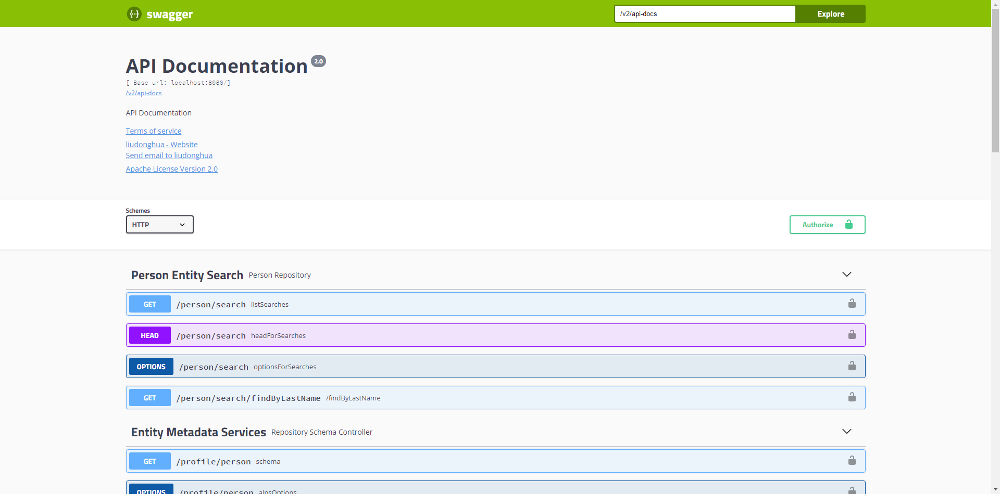

# spring-data-rest-swagger

### What's it

This is a sample demo to demonstrate `Accessing JPA Data with REST` and `Show and Test your api in swagger-ui`

### How to run

1. git clone https://github.com/liudonghua123/spring-data-rest-swagger
2. cd spring-data-rest-swagger
3. mvn spring-boot:run
4. navigation to [localhost:8080/swagger-ui-standalone.html#/](localhost:8080/swagger-ui-standalone.html#/)

You can see the automatic generated API documentation at `/v2/api-docs`

### More

Some useful links

1. [Accessing JPA Data with REST][Accessing JPA Data with REST]
2. [Springfox Swagger UI][Springfox Swagger UI]
3. [Swagger-UI][swagger-ui]

[Accessing JPA Data with REST]: https://spring.io/guides/gs/accessing-data-rest/
[Springfox Swagger UI]: https://github.com/springfox/springfox/blob/master/docs/asciidoc/getting_started.adoc#springfox-swagger-ui
[swagger-ui]: https://github.com/swagger-api/swagger-ui